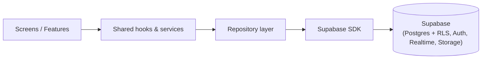
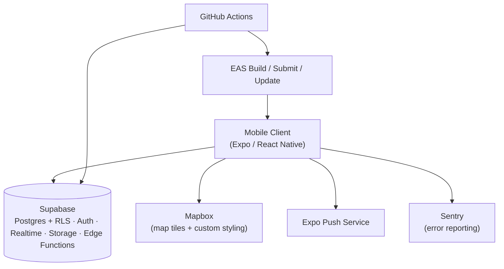
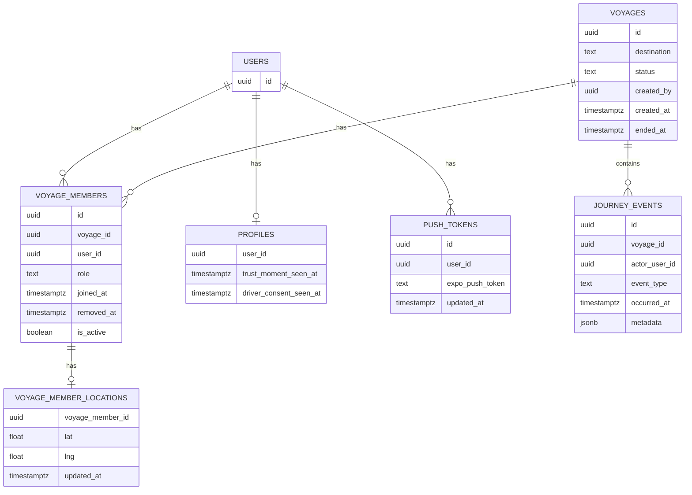

# Architecture Spine — Voylo

## Design Paradigm

**BaaS-centric layered architecture.** The mobile client is the only custom-built unit; authentication, database, real-time sync, file storage, and serverless logic run entirely on a managed backend-as-a-service (Supabase) — there is no server to operate, patch, or scale by hand. Chosen specifically because every layer must be buildable and operable by an AI coding agent with no manual infrastructure work from the founder.

The client itself is layered top-down:

```text
Screens/Features  ->  Shared hooks/services  ->  Repository layer  ->  Supabase SDK
```

No screen or feature module talks to the Supabase SDK directly — everything passes through a repository (see AD-5).

## Invariants & Rules



### AD-1 — Voyage-scoped data access boundary

- **Binds:** all Voyage-related tables (`voyage_members`, `voyage_member_locations`, and future `fun_facts`/`photos` in v1.1).
- **Prevents:** two independently-built features implementing inconsistent authorization checks in application code, leaking one Voyage's data to non-members.
- **Rule:** authorization is enforced via Postgres Row-Level Security policies keyed on `voyage_members` membership — never via application-layer checks alone. All such RLS policies call one shared Postgres function/predicate (e.g. `is_active_voyage_member(voyage_id, user_id)`), defined once, that requires both `removed_at IS NULL` on the membership row AND the parent Voyage's `status = 'active'` — rather than each policy re-deriving its own membership check, which could leave removed members or ended-Voyage data readable under a technically-different-but-non-compliant policy. Matches the PRD's hard privacy requirement that Voyage data never leaves that Voyage's own Voyagers.

### AD-2 — Single Voyage real-time message bus `[REVISED 2026-08-10]`

- **Binds:** Live Map (FR-9); future Fun Fact notifications (FR-10/FR-11, v1.1).
- **Prevents:** divergent polling or ad hoc WebSocket schemes across features; a separate ad hoc Realtime channel being opened per feature instead of sharing one channel per Voyage.
- **Rule:** Supabase Realtime is the sole live relay. Each active Voyage has one private, repository-managed channel carrying a versioned union of location, presence, lifecycle, journey-event, alert, reaction, and future game messages. Healthy foreground location uses client WebSocket Broadcast; authoritative database changes and durable journey events use server/database Broadcast. Features register typed handlers on the shared channel instead of opening competing channels.

### AD-3 — Hybrid live-location model `[REVISED 2026-08-10]`

- **Binds:** Live Map (FR-9).
- **Prevents:** database latency on every marker frame, forged identities, stale timestamps appearing current, unbounded history/backlogs, packet reordering, and reconnect divergence.
- **Rule:** location has two paths. The fast path sends a versioned, authenticated `location.updated` signal over the shared Voyage channel and updates the sender's self marker locally. The durable path coalesces to the newest fix and periodically overwrites one `voyage_member_locations` snapshot through an authenticated RPC. Each fix preserves GPS capture time, speed, heading, accuracy, sender-session id, and monotonic sequence. Receivers reject duplicate/out-of-order state and merge snapshots without regressing newer signals. Background/socket-unavailable publication may use the snapshot RPC's server broadcast. No location queue is replayed as live movement and no unbounded history is appended.

### AD-4 — Single auth session source of truth `[ADOPTED]`

- **Binds:** all screens/features.
- **Prevents:** divergent, screen-local session/token handling.
- **Rule:** one shared auth context/hook wraps the Supabase Auth client (email OTP, per PRD FR-1/FR-2); no screen manages its own session or token state. Session revocation (PRD §5.5) is satisfied natively — sign-out calls `supabase.auth.signOut({ scope: 'global' })`, which revokes refresh tokens on every device; no separate infrastructure needed.

### AD-5 — Repository layer required

- **Binds:** all data access.
- **Prevents:** inconsistent query shapes and caching behavior across independently-built features; gives an AI dev agent one obvious place to add new data access rather than inventing a new pattern per feature.
- **Rule:** every Supabase query or mutation goes through a per-entity repository module (e.g. `voyageRepository`, `memberRepository`). No screen or hook calls the Supabase client SDK directly. Each database table has exactly one owning repository module (1:1 mapping) — e.g. `voyage_members` is owned solely by `memberRepository`. A feature needing to write to a table it doesn't own imports and calls that table's existing repository rather than authoring a second, competing repository for the same table (e.g. both `voyage-setup` and `organizer` write to `voyage_members` — both go through `memberRepository`, neither builds its own).

### AD-6 — Environment separation `[ADOPTED]`

- **Binds:** deployment, CI/CD, secrets.
- **Prevents:** dev/test activity touching production data or credentials.
- **Rule:** two environments (dev / prod) — simplified from an originally-planned three (dropping a separate staging tier) as a deliberate scope decision during implementation — each backed by its own Supabase project and its own EAS build profile. No shared credentials or data across environments.
- **Promotion pipeline:** merges to `main` trigger GitHub Actions to run migrations against the dev Supabase project and build the `development` EAS profile. Prod promotion — migrations against the prod Supabase project, plus the `production` EAS build — runs on tagged releases or manual workflow dispatch, never automatically on every push.

### AD-7 — Offline resilience

- **Binds:** all Voyage lifecycle writes (start/join/end/grant/remove) and future Fun Fact/photo writes (v1.1).
- **Prevents:** a write attempted through a cellular dead zone silently failing or corrupting Voyage state — a real risk on multi-hour highway drives (PRD Cross-Cutting NFR: Reliability).
- **Rule:** the client persists durable commands/events in an idempotent outbox and separately retains only the newest unsent location. On reconnect it authenticates, reconciles Voyage/membership, restores server snapshots, publishes the newest local fix, then flushes durable items. One conflict does not block unrelated items. Historical GPS fixes are never replayed as current movement; route-history collection, if introduced for Memory Lane, is a separate data product.

### AD-8 — Background location capability

- **Binds:** Live Map (FR-9).
- **Prevents:** location updates silently stopping when a Voyager's phone is locked or the app is backgrounded — the normal state for a passenger on a long drive.
- **Rule:** the client uses `expo-location` plus `expo-task-manager` while backgrounded (iOS location mode; Android location foreground service). It must not assume a JavaScript WebSocket survives suspension: when the shared channel is unavailable, the authenticated snapshot RPC persists and broadcasts the newest fix. A force-killed app, revoked permission, OS/vendor suppression, or dead battery may stop tracking; receivers age that location to last-known rather than claiming it remains live.
- **Note:** background location and Mapbox's native modules require an EAS development build for testing — neither works in Expo Go. Mapbox's native SDK should be pinned to v11 (not the deprecated v10) via the `RNMapboxMapsVersion` build config, so no one accidentally locks an old default.

### AD-9 — One active Voyage per user

- **Binds:** `voyage_members`.
- **Prevents:** a user silently belonging to two active Voyages at once, which EXPERIENCE.md's information architecture assumes is impossible.
- **Rule:** this is a global-per-user constraint — one active Voyage across the whole system, not per-Voyage. It's enforced with a denormalized boolean column, `is_active`, on `voyage_members`, kept in sync with the parent Voyage's `status` via a database trigger (or updated transactionally whenever Voyage status changes) — a partial unique index cannot itself reference `voyages.status` across tables, hence the denormalized column. A partial unique index on `voyage_members(user_id) WHERE removed_at IS NULL AND is_active = true` then guarantees at most one such row per user, enforced in the database, not just client logic.

### AD-10 — Deep-linking via universal/app links

- **Binds:** FR-4, FR-5.
- **Prevents:** two different link-handling implementations between invite-generation code (creating the Join Code/Link) and invite-consumption code (the screen that opens it).
- **Rule:** the Join Code/Link (PRD FR-4/FR-5) uses Expo Router's universal/app-link support — associated domains on iOS, App Links on Android — rather than a bare custom URI scheme, since v1 has no web companion to fall back to. If the app isn't installed, the link redirects to the App Store/Play Store; if it is installed, the link opens directly into the Join Invitation screen.

### AD-11 — Custom OTP email delivery via Resend `[ADOPTED, added during implementation]`

- **Binds:** Story 1.2 (Email OTP Sign-In, FR-1).
- **Prevents:** shipping Supabase's default built-in auth emails — generic template, no Voylo branding, low daily-send limits on the built-in mailer.
- **Rule:** Supabase Auth's **Send Email** HTTP Hook is wired to a Supabase Edge Function (`supabase/functions/send-otp-email`) instead of Supabase's built-in emailer. Auth calls the hook with the OTP payload (recipient, the numeric code, email action type); the function verifies the hook's signing secret, renders a branded HTML template (Night Drive identity, per `DESIGN.md`) with the code, and sends it via Resend's API. No screen or repository sends email directly — this hook is the single OTP-email send path.
- **Sending domain:** `voyloapp.com`, verified in Resend (DKIM/SPF/DMARC records added at the registrar) — sends from `noreply@voyloapp.com`. `[ADOPTED, updated post-launch-prep]` Originally shipped against Resend's shared test domain (`onboarding@resend.dev`), which only delivers to the Resend account owner's own address; swapped once a real domain was purchased and verified, confirming the original design's own prediction that this would be a Resend/config change (from-address + domain verification), not a code change.
- **Secrets:** `RESEND_API_KEY` and the hook's signing secret are Supabase Edge Function secrets (`supabase secrets set`), set per environment (dev/prod) — never client-exposed, never `EXPO_PUBLIC_`-prefixed.

### AD-12 — Versioned Voyage message envelope `[ADOPTED 2026-08-10]`

- **Binds:** every AD-2 message.
- **Rule:** messages carry `protocolVersion`, `messageId`, `voyageId`, authenticated sender identity, sender-session id, monotonic sequence, type, capture time, send time, and a typed payload. Unknown versions/types are ignored safely. Precise coordinates never enter general diagnostic logs.

### AD-13 — Freshness, presence, and rendering `[ADOPTED 2026-08-10]`

- **Binds:** Live Map status and marker motion.
- **Rule:** Presence means a connected Realtime session only; it is not proof of GPS, background execution, or physical reachability. Per-Voyager status combines Presence, last GPS capture time, and explicit location health. The self marker is immediate. Remote markers use a short jitter buffer, accuracy-aware interpolation and at most two seconds of bounded prediction; prediction stops for stale/poor fixes and long gaps snap.

### AD-14 — Durable journey-event authority `[ADOPTED 2026-08-10]`

- **Binds:** Fun Facts, detected stops, sightings, alerts, games, and Memory Lane inputs.
- **Rule:** consequential journey events are idempotent `journey_events` rows created by authenticated server logic and broadcast on the shared channel. Disposable reactions may remain ephemeral. Offline events retain `occurred_at`, queue locally, and reconcile after reconnect. Automated stop detection uses an accuracy-aware hysteresis state machine; a client may propose a candidate, but the server deduplicates and owns the event.

### AD-15 — Operability and safe activation `[ADOPTED 2026-08-10]`

- **Binds:** deployment and production tuning.
- **Rule:** fast Broadcast and durable snapshots are independently controllable so disabling the fast path cannot remove recovery. Migrations remain compatible through the mobile adoption window. Production activation requires two-car passing tests, 2/4/8-member load tests, capture-to-render p50/p95, background/force-kill/dead-zone tests, Supabase quota verification, and multi-hour battery measurements.

## Consistency Conventions

| Concern | Convention |
| --- | --- |
| Naming (entities, files, interfaces, events) | Postgres tables/columns: `snake_case`. TypeScript types/variables: `camelCase`, mapped at the repository boundary. Repository modules named `<entityName>Repository` (e.g. `voyageRepository`). |
| Data & formats (ids, dates, error shapes, envelopes) | Primary keys: Postgres `uuid`. Timestamps: `timestamptz`, ISO 8601 on the wire. Errors surfaced from repositories as a typed `{ code, message }` shape, never a raw Supabase error object. |
| State & cross-cutting (mutation, errors, logging, config, auth) | All writes go through repositories (AD-5); all authorization through RLS (AD-1); all live updates through Realtime (AD-2); one shared auth context (AD-4); Sentry captures unhandled errors in every environment. |

## Stack

| Name | Version |
| --- | --- |
| React Native (Expo, managed workflow) | SDK 56 |
| Expo Router | current (Expo SDK 56) |
| TypeScript | latest stable |
| EAS Build / Submit / Update | current (Expo Application Services) |
| Supabase (Postgres, Auth, Realtime, Storage, Edge Functions) | current hosted platform |
| Mapbox (`@rnmapbox/maps`) | current, pinned to native SDK v11 (AD-8) |
| Expo Notifications | current (bundled with Expo SDK 56) |
| `expo-location` + `expo-task-manager` (background location, AD-8) | current, compatible with Expo SDK 56 |
| GitHub Actions | n/a (hosted CI) |
| Sentry (React Native SDK) | current, free tier |
| Resend (`resend` npm package, used server-side in a Supabase Edge Function only) | current, free tier — AD-11 |

## Structural Seed



### Core entities (v1)



`role` on `voyage_members` is `organizer` or `voyager`; a Voyage may have more than one `organizer` row (AD supporting PRD FR-7, Grant Organizer Status). `removed_at` supports PRD FR-8 (Remove Voyager) without deleting history. `is_active` is the denormalized, trigger-maintained flag that backs the AD-9 partial unique index (one active Voyage per user, globally). `voyage_member_locations` remains latest-only and stores capture/quality/ordering metadata under AD-3. `journey_events` is the idempotent durable timeline under AD-14. `profiles` makes the Trust Moment and Driver Attention Consent screens (EXPERIENCE.md) enforceably "once ever." `push_tokens` backs notification delivery; dispatch runs through a Supabase Edge Function.

### Environments

| Environment | Supabase project | EAS profile |
| --- | --- | --- |
| dev | `voylo-dev` | `development` |
| prod | `voylo-prod` | `production` |

`[ADOPTED, updated during implementation]` Simplified from an originally-planned three-environment (dev/staging/prod) setup to two (dev/prod) — a deliberate scope reduction, not a gap. The `preview` EAS profile from Expo's default `eas.json` is still available if internal stakeholder-testing builds are needed later; it just isn't tied to a dedicated Supabase project.

### Source tree

```text
voylo/
  src/
    app/                  # Expo Router screens (Voyage Intro, Destination Picker, Join Invitation, Live Map, ...)
    features/
      auth/                # email OTP sign-in, session bootstrap
      voyage-setup/         # start Voyage, join via code, destination picker
      organizer/            # end Voyage, grant Organizer status, remove Voyager
      live-map/              # real-time Voyager map (Mapbox)
    shared/
      hooks/                 # auth context, shared cross-feature hooks
      components/             # UI built from DESIGN.md tokens
      outbox/                  # offline write-queue (AD-7)
    repositories/              # voyageRepository, memberRepository, locationRepository, profileRepository
    lib/
      supabase.ts               # Supabase client init
      sentry.ts                  # error reporting init
  supabase/
    migrations/                 # SQL migrations, incl. RLS policies (AD-1)
    functions/                    # Edge Functions
```

`[ADOPTED, updated during implementation]` Everything except `supabase/` (which Supabase CLI's own tooling expects at the repo root, unrelated to app source) is nested one level deeper under `src/` than originally shown here. This follows Expo SDK 57's `create-expo-app` default template convention, current as of Story 1.1's implementation — not a deviation of choice, and now the canonical tree going forward. `supabase/` stays at the repo root.

## Capability → Architecture Map

| Capability / Area | Lives in | Governed by |
| --- | --- | --- |
| FR-1, FR-2 (Passwordless auth, session) | `features/auth` | AD-4, Supabase Auth |
| FR-3, FR-4, FR-5 (Start Voyage, Join Code/Link, Join) | `features/voyage-setup` | AD-1, AD-5, AD-10 |
| FR-6, FR-7, FR-8 (End Voyage, Grant Organizer, Remove Voyager) | `features/organizer` | AD-1, AD-5, AD-6 |
| FR-9 (Live Map) | `features/live-map` | AD-2, AD-3, AD-8, Mapbox |
| Trust Moment, Driver Attention Consent (EXPERIENCE.md) | `features/auth` | `profiles` table |
| Notification-permission priming flow (EXPERIENCE.md) | `features/live-map`, `shared/hooks` | `push_tokens` table, Edge Function |
| Offline/dead-zone resilience (PRD §5.5) | `shared/services` (write-outbox) | AD-7 |

## Deferred

- **AI content-generation pipeline** — provider confirmed as **Groq** (verified current: cheap, fast, generous free tier) for when this feature is actually scoped; the feature itself is an open question in the PRD, not in v1 or v1.1, so the pipeline is not designed here.
- **Fun Fact Capture + Memory Lane** (PRD FR-10–FR-16) — v1.1. Will need new tables (`fun_facts`, `photos`) and Edge Functions (long-stop/border-crossing detection, Memory Lane generation) once scoped.
- **Phone-number OTP** — planned after email OTP proves out (PRD).
- **Web companion** (for viewing a shared Memory Lane without the app) — post-v1, not architected here.
- **Payments/monetization infrastructure** — PRD assumes free-for-now; no billing integration exists yet.
- **Multi-destination/multi-leg itineraries** — explicitly out of scope for v1 (PRD FR-3).
- **One-time manual setup** — before any code or CI can run, a human has to complete a handful of one-time account and administrative steps: creating accounts/projects with **Supabase** (x3 — dev, staging, prod), **Mapbox**, **GitHub**, and **Sentry**; enrolling in the **Apple Developer Program** ($99/yr) and the **Google Play Developer** account (one-time registration fee); and requesting Apple's **iOS Time-Sensitive notification entitlement** (an administrative approval through the Apple Developer Program, not a code/CI-automatable task). None of this can be done by an AI agent — account signup, accepting platform terms, and paying developer-program fees all require a human. This is a one-time, upfront cost only: everything after it — all code, config, database schema, CI/CD, and ongoing deploys to dev/staging/prod — is fully AI-automatable with zero further manual involvement.
- **App Store review scrutiny for background location** — apps that use background location face extra App Store review attention (clear purpose strings, review notes expected). This is a process risk in the same category as the Time-Sensitive entitlement request above, not a code problem.
