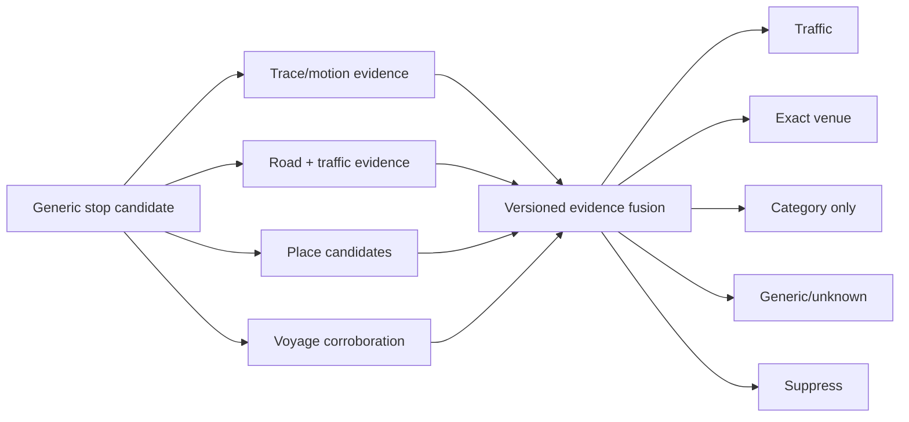

# Architecture Extension — Stop Intelligence

This capability extends AD-2/AD-14 but is not yet authorized for implementation. The complete technical narrative, diagrams, failure matrix, provider research, domain contract, and validation plan live in `docs/VOYLO-STOP-INTELLIGENCE-ARCHITECTURE.md`.

## Binding proposal

1. Stop detection is generic and provider-independent; no detector is named after coffee, fuel, or another conclusion.
2. Detection, stop-versus-traffic classification, and venue/category classification are separate stages.
3. Mapbox supplies primary road matching, traffic context, and POI candidates. A secondary place provider is adaptive, not unconditional.
4. The durable entity is one idempotent `stop` journey event with a lifecycle; category is normalized metadata, not a proliferation of event types.
5. Exact names require calibrated high confidence and a provider-licensing decision. Medium confidence produces category-only copy; low confidence produces generic copy or no event.
6. Presence of a nearby POI never proves a visit. Trace geometry, road alignment, traffic, convoy corroboration, dwell, accuracy, and entry/exit behavior are fused.
7. User correction updates the existing event and is the final product truth.
8. Shadow-mode field validation precedes user-visible automatic classification.

## Gate

No application code, schema, provider account, or automated notification should be created from this extension until the review decisions in the full document are resolved.
