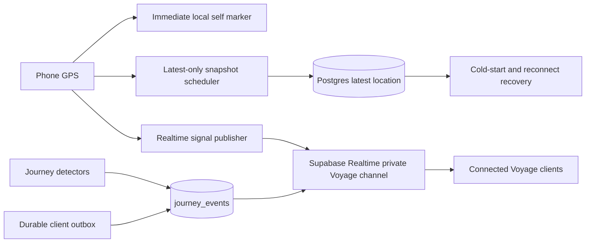

# Voylo Live Journey Architecture

**Status:** Canonical implementation reference  
**Protocol:** `voylo-live-journey/v1`  
**Updated:** 2026-08-10

## Purpose

Voylo is a live group-journey system, not merely a location table displayed on a map. Its runtime separates low-latency signals from durable truth so marker movement can be immediate without sacrificing authorization, recovery, offline behavior, or the future journey-event system.

## System shape

## Responsibility split

| Concern | Authority | Delivery |
| --- | --- | --- |
| Current marker movement | Newest valid, ordered signal | WebSocket Broadcast; HTTP/database fallback in background |
| Reconnect position | `voyage_member_locations` | RPC snapshot read |
| Membership and Voyage lifecycle | Postgres/RLS | Database transaction plus Broadcast |
| Journey event | `journey_events` | Idempotent RPC plus Broadcast |
| Connected-session presence | Supabase Presence | Realtime presence sync |
| Location freshness | Receiver clock applied to `captured_at` | Derived locally, backed by server snapshot |

## Location message

Every location signal contains a protocol version, globally unique message id, sender session id, monotonic sequence, GPS capture time, send time, coordinate, heading, speed and accuracy. Receivers order by `(sender_session_id, sequence)` and use capture time for freshness. Arrival time is never presented as measurement time.

The self marker consumes the GPS fix locally and never waits for a network round trip. Connected foreground clients publish through the existing private Voyage WebSocket. Durable snapshots are coalesced latest-only and written periodically, on lifecycle transitions, and after reconnect. Background execution may not retain a JavaScript socket, so the authenticated snapshot RPC remains the safe fallback and emits the same compatible location signal.

## Rendering

Remote markers use a short jitter buffer and bounded dead reckoning, not a long animation toward an already historical coordinate. Prediction is limited to two seconds, requires usable speed/heading/accuracy, and stops for stale data. New measurements reconcile over a short animation; long gaps snap. Freshness states are `live`, `delayed`, `stale`, `offline_or_suspended`, `location_unavailable`, and `never_reported`.

## Delivery semantics

- Location signals are ephemeral, unordered and potentially lossy; sequence validation and the next signal repair loss.
- Only the newest unsaved location is retained offline. Historical locations are never replayed as live movement.
- Journey events and lifecycle commands are durable, idempotent and queued until acknowledged.
- Reconnect order is: authenticate, authorize membership, fetch lifecycle/roster, fetch latest snapshots, publish newest local fix, flush durable events.
- Older protocol versions remain readable during an app-release compatibility window.

## Connectivity matrix

| Condition | Publisher | Viewer |
| --- | --- | --- |
| Healthy foreground | WebSocket signal plus periodic snapshot | Live interpolation/prediction |
| Slow WebSocket | Latest-only coalescing | Jitter buffer; never regress sequence |
| Socket down, HTTP up | Snapshot RPC/server broadcast | Delayed but recoverable |
| No internet | Persist newest fix and durable events | Age marker to last-known state |
| Internet restored | Send newest fix, reconcile, flush events | Merge by sequence/capture time |
| App backgrounded | OS background task; snapshot/broadcast fallback | Freshness reflects actual reports |
| App force-killed | Platform may stop GPS entirely | Marker becomes stale; never claim live |
| GPS unavailable | Publish/retain explicit health when possible | Show location unavailable |
| Supabase unavailable | Local GPS/UI continue; outbox retained | Existing positions age naturally |

## Reachability

Presence proves only that a Realtime session is connected. It does not prove GPS availability, background execution, internet reachability of every app process, or physical safety. Voylo combines Presence with `last captured location` and explicit client health. Supabase cannot perfectly distinguish a force-killed app from a dead battery or lost network; the UI therefore says `last updated` rather than inventing a cause.

Initial freshness thresholds are: live under 3 seconds, delayed 3–10 seconds, stale 10–30 seconds, and offline-or-suspended after 30 seconds without Presence. Thresholds are configuration, not protocol constants.

## Journey events

The channel carries typed event signals in addition to location. Important events are inserted into `journey_events` first and broadcast by the server, preventing impersonation, duplication, and history loss. Ephemeral reactions may be Broadcast-only.

A coffee-stop detector is a hysteresis state machine: `moving -> stop_candidate -> confirmed -> exited`. A candidate requires low speed and coordinates clustered within an accuracy-aware radius. Five continuous minutes confirms it; a larger exit radius prevents GPS noise from repeatedly reopening the stop. The client can detect candidates from high-cadence GPS, but the server owns the idempotent event. Offline detections retain their real `occurred_at` and publish after reconnect as late events.

## Security

- Every channel is private and Voyage-scoped.
- SELECT and INSERT Realtime policies require active membership.
- A location write may identify only `auth.uid()`; client-supplied identity is validated or overwritten.
- Durable events are created by security-definer RPCs that derive membership from `auth.uid()`.
- Removed members and ended Voyages cannot publish, subscribe anew, snapshot, or create events.
- Payload ranges, age, size and rate are validated.
- Service-role keys never ship in the app.

## Capacity and battery

Broadcast fan-out grows approximately with `N × (N-1)`. Publishing adapts to motion: high cadence while moving, heartbeat cadence while stationary, and no identical one-second spam. Snapshot frequency is lower than signal frequency. Production gates include 2/4/8-member load tests, Supabase quota verification, multi-hour screen-on/off battery measurements, and p50/p95 GPS-capture-to-render latency.

## Deployment and rollback

Schema changes are backward compatible: legacy `upsert_location` remains during migration and new clients use the v1 message/snapshot path. The fast path is controlled independently from durable snapshots so it can be disabled without losing recovery. Deployment order is schema/RLS, compatible client, internal enablement, field test, measured rollout, then legacy retirement.

The client kill switch is `EXPO_PUBLIC_LIVE_JOURNEY_FAST_PATH=false`. It disables direct client Broadcast while leaving periodic snapshot RPCs and their server broadcasts operational.

## Required observability

Record GPS capture age, accuracy, publish transport, send result, snapshot latency/error, channel status, receive age, rejected sequence count, render latency, reconnect count, freshness transitions, event deduplication, and outbox depth. Precise coordinates must not be placed in general diagnostic logs.
