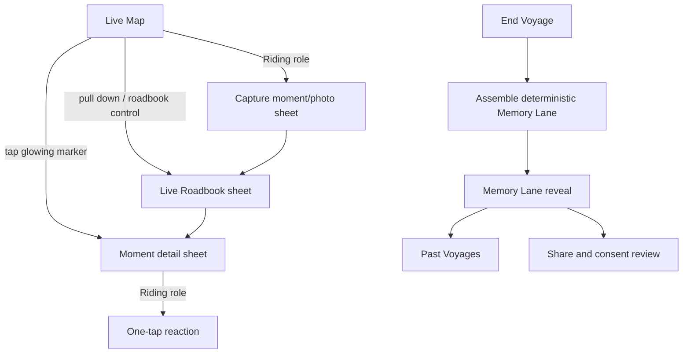
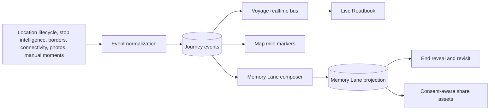

# The Living Voylo

**Status:** Approved direction for future planning; not implemented

**Created:** 2026-08-10

**Product role:** Voylo's differentiated live-story and post-trip memory loop

## Executive decision

The strongest next major capability is **The Living Voylo**: a trustworthy story of the road trip that assembles while the Voyage is active and transforms into a cinematic, revisitable Memory Lane when the Voyage ends.

The live map answers, “Where is everyone?” The Living Voylo answers, “What is our journey becoming?” These are not separate products. They are two views of the same Voyage-scoped, durable event timeline.

The defining product loop is:

```text
Start together
  -> watch each other move
  -> capture the unexpected
  -> relive the story
  -> share it safely
  -> want to start another Voyage
```

This capability earns Voylo's promise: **every journey tells a story, and Voylo makes sure you never miss it.**

## Why this feature wins

Voylo is not primarily a convoy-management utility. Its bedrock idea is to let people experience a journey together even when they are physically separated across cars. The map creates shared presence and anticipation; the story layer turns ordinary telemetry into emotional meaning.

Without the story payoff, Voylo risks becoming a polished version of temporary location sharing. With The Living Voylo:

- Tracking becomes entertainment rather than administration.
- Stops and delays become story beats rather than failures.
- Passive Voyagers receive value without interacting while driving.
- Passenger contributions enrich a shared artifact.
- Ending a Voyage becomes an anticipated reveal rather than a shutdown action.
- A shareable “Voylo” becomes the acquisition loop: “Send me your Voylo.”

The feature also compounds the architecture already built: the Voyage message bus supplies immediacy, `journey_events` supplies durable truth, stop intelligence supplies classified moments, and the offline outbox preserves real occurrence time through dead zones.

## Experience concept

### 1. Live Roadbook

During an active Voyage, a passenger can pull down from the map to reveal a chronological roadbook. It is not chat and it is not a social feed demanding attention. It is a calm, ambient record assembled from trusted events.

Example cards:

- “The Voyage began — 8:42 AM.”
- “Maya joined fashionably late.”
- “The convoy crossed into Virginia.”
- “Pit stop — 14 minutes at a rest area.”
- “The group split by 23 minutes.”
- “Everyone is back together near Richmond.”
- “Off the grid for 18 miles.”
- A passenger's photo and optional caption.
- “The map predicted five hours. You’re making a day of it.”

The feed is derived from structured facts. Copy may be playful, but it may never invent a stop, place, person, action, or statistic.

### 2. Route Mile Markers

Meaningful events appear as glowing mile markers along the route. Tapping a marker opens its moment card: a stop, photo, border crossing, reunion, or other event.

This changes the meaning of the map over time. At the beginning it is a live tracking surface. By the end it has become a visual memory trail.

Markers must be selectively curated. A marker for every GPS update would create noise and reveal unnecessary precision. Only durable, product-relevant events become story markers.

### 3. Passenger contributions

Riding-role Voyagers may add texture with minimal interaction:

- Take or attach a photo.
- Choose a simple moment category.
- Add an optional short caption.
- React to an existing moment with one tap.

Driving-role Voyagers never receive manual capture controls. Their experience remains passive and ambient.

Presence itself counts as participation. A Voyager who adds nothing manually still appears fully in the story and recap; their contribution card is simply less decorated, never dimmed, ranked, or shamed.

### 4. End-of-Voyage reveal

Ending the Voyage triggers a ceremonial transition into Memory Lane. New capture stops, already-running durable uploads finish, and the server composes a deterministic first version immediately.

The reveal may contain:

- Opening title, destination, date, and participating Voyagers.
- Animated route and meaningful mile markers.
- Planned-versus-actual travel time.
- Distance and time traveled together.
- States or countries crossed.
- Classified stops and time spent there.
- Group split and reunion moments.
- Photos, captions, and reactions.
- Verified personality titles or badges.
- A final group card suitable for sharing.

The voice is cinematic rather than report-like. Delays and detours are reframed as the experience:

> The map said five hours. The memories took twelve.

Memory Lane is independently viewable by every participant and remains revisitable after the active Voyage ends.

## Information architecture

Voylo remains map-first and does not gain a persistent tab bar.



The roadbook is an overlay on gameplay, not a destination competing with the map. Moment detail, capture, and reactions use sheets/toasts consistent with Voylo's existing interaction model.

## One source of truth

The system must not create separate “live feed” and “recap” datasets. One canonical event timeline supports both.



The live roadbook renders newly broadcast events immediately, then reconciles them against durable rows. Memory Lane is a versioned projection of the same rows, not an AI-generated alternative history.

## Event taxonomy

Initial event families:

| Family | Examples | Source | Default visibility |
| --- | --- | --- | --- |
| Voyage lifecycle | started, ended | Server-authoritative | Live and recap |
| Membership | joined, left, removed, role granted | Server-authoritative | Selective |
| Movement story | group split, group reunion, arrival | Server classifier | Shadow first |
| Place/stop | fuel, coffee, food, rest area, scenic, generic stop | Stop intelligence | Confidence-gated |
| Geographic | state/country border crossing | Server classifier | Recap by default |
| Connectivity | meaningful offline interval | Device proposal + server validation | Recap by default |
| Manual moment | sighting, construction, custom | Riding-role user | Live and recap |
| Media | photo, caption | Riding-role user | Live and recap |
| Social response | reaction | Voyage member | Live; aggregate in recap |
| Computed fact | planned vs actual, total distance, longest leg | Composer | Recap |

Avoid building dozens of event types for presentation wording. Durable events describe facts; presentation templates turn facts into copy.

## Proposed domain model

```ts
type JourneyMoment = {
  id: string;
  voyageId: string;
  type: string;
  status: 'proposed' | 'confirmed' | 'suppressed' | 'corrected';
  occurredAt: string;
  endedAt: string | null;
  actorUserId: string | null;
  vehicleGroupId: string | null;
  location: {
    lat: number;
    lng: number;
    precision: 'exact' | 'approximate' | 'hidden';
  } | null;
  payload: Record<string, unknown>;
  source: 'server' | 'automatic' | 'manual' | 'computed';
  classifierVersion: string | null;
  visibility: 'live' | 'recap' | 'both' | 'private';
  createdAt: string;
  updatedAt: string;
};
```

Media, reactions, consent, and recap projections should be separate owned entities referencing the canonical moment. Large binary assets never belong in event payloads.

## Deterministic narration first

The first release should use versioned templates rather than generative AI:

```text
stop + rest_area + 14 minutes
  -> “A 14-minute rest-area reset.”

member.joined + 3h12 after start
  -> “Fashionably late — Priya joined 3 hours in.”
```

Benefits:

- Fast and inexpensive.
- Works immediately at end-of-Voyage.
- Auditable and testable.
- Safe from fabricated events.
- Supports offline/retry behavior cleanly.
- Establishes which story beats users actually value before adding AI cost.

## AI story layer later

AI may later rewrite a verified set of moments into alternative narrative styles, titles, or transitions. It is a presentation layer only.

Hard rules:

- AI receives normalized, privacy-filtered event summaries—not unrestricted location history.
- AI cannot create or delete canonical events.
- Names, places, times, statistics, and attributions must come from verified structured fields.
- Generated text stores model/prompt/template versions.
- Users can regenerate, edit, or fall back to deterministic copy.
- AI failure never blocks Memory Lane generation.
- No silent training on private Voyage content.

## Phased build plan

### Slice A — Timeline foundation

- Generalize durable journey-event reads and updates.
- Add cursor-based event history for active and completed Voyages.
- Add lifecycle/member events.
- Build Roadbook sheet with deterministic event cards.
- Reconcile Realtime messages with database history by event id.
- Add loading, empty, offline, stale, correction, and unsupported-version states.

**Proof:** two phones see the same ordered roadbook through reconnects.

### Slice B — Passenger moments and photos

- Riding-role capture control.
- Moment category picker, optional caption, and photo.
- Durable media upload outbox and resumable state.
- Per-media ownership and Voyage-scoped RLS.
- Basic one-tap reactions.
- Content deletion/correction rules.

**Proof:** a passenger captures a moment in a dead zone and the group sees it once connectivity returns, without duplication.

### Slice C — Trusted automatic moments

- Integrate calibrated stop intelligence outputs.
- Add border crossing and meaningful connectivity intervals.
- Shadow-test group split/reunion and arrival classifiers.
- Add event correction and suppression workflows.
- Add companion/vehicle grouping before group-level deduplication.

**Proof:** field dataset meets per-event precision gates; uncertain classifications become generic or remain hidden.

### Slice D — Memory Lane v1

- Versioned deterministic composer.
- Route simplification and meaningful mile-marker selection.
- Opening, route, moment, stat, photo, and finale cards.
- End-Voyage assembly state and idempotent regeneration.
- Past Voyages list and revisiting.
- Solo-Voyage and low-content fallbacks.

**Proof:** every ended Voyage receives a complete recap quickly, even with no photos and no AI provider.

### Slice E — Consent-aware sharing

- Share-asset selection.
- Identify content owned by or featuring other Voyagers.
- Approve/decline requests scoped to one share action.
- Automatically exclude declined/unanswered material.
- Generate still cards first; video export later.

**Proof:** no participant's protected content leaves Voylo without the required consent.

### Slice F — Narrative intelligence and polish

- Optional AI rewrites from verified facts.
- Multiple story moods.
- Thematic sound design.
- More sophisticated personality titles.
- Video/trailer export if measured demand justifies its cost.

## Rollout strategy

1. Internal deterministic events only.
2. Live roadbook for internal/test Voyages.
3. Passenger photos and manual moments.
4. Shadow automatic classifiers.
5. High-confidence automatic story cards.
6. Deterministic Memory Lane.
7. Still-image external sharing with consent.
8. Optional AI narration.
9. Video generation only after sharing behavior is proven.

Feature flags should independently control live cards, each classifier family, route markers, recap generation, sharing, and AI narration. Disabling a presentation feature must not delete canonical events.

## Negative scenarios and required behavior

| Scenario | Required behavior |
| --- | --- |
| No internet for hours | Capture locally; preserve occurrence time; upload idempotently later |
| Duplicate device retry | One canonical event by stable idempotency key |
| Realtime message arrives before database row | Render provisional card, then reconcile |
| Database history arrives after newer live event | Merge without regressing or duplicating |
| Organizer ends while photo uploads | Stop new capture; allow accepted in-flight upload to finish |
| No photos/manual contributions | Produce a complete telemetry-based Memory Lane |
| Solo Voyage | Produce a complete personal Memory Lane |
| Incorrect automatic classification | Correct/suppress the existing event; do not append a contradictory duplicate |
| Provider unavailable | Use generic or deterministic fallback; never block location or ending the Voyage |
| Force-killed app | Resume pending durable uploads when the active session returns |
| Voyager removed | Immediately lose live access and future capture authority |
| Voyage completed | Stop location; retain only explicitly governed recap data |
| New app sees unknown event version | Ignore safely and continue rendering supported events |
| Sensitive place | Hide or generalize location/category; never infer sensitive personal traits |
| Driver role | No capture or edit controls; notifications remain passive |
| Empty/quiet story | Use restrained route/time/group cards, never fabricate excitement |

## Privacy, trust, and retention

- All moments are Voyage-scoped and protected by membership-aware RLS.
- Precise raw traces are not the Memory Lane product and receive short, bounded retention.
- Recaps prefer simplified routes and approximate marker locations where exact coordinates add no value.
- Sensitive-place filtering happens before narration and sharing.
- General logs and Sentry never receive precise coordinates, photo contents, captions, or generated private stories.
- Completed-Voyage access requires an explicit participant-history policy; “active member only” is insufficient for revisitable Memory Lane and must be designed carefully.
- Deletion behavior must specify whether deleting a source photo removes derived thumbnails/share assets.
- External sharing is a separate consent boundary, not implied by joining a Voyage.

## Safety guardrails

- The Living Voylo requires no interaction from anyone.
- Manual capture is absent for Driving-role users.
- Live cards use short, glanceable copy and passive audio/haptic cues.
- No real-time police-evasion tooling.
- No missed-exit accusations or route-deviation alerts.
- Competitive stats must not reward unsafe speed or driving without breaks.
- “Fastest driver” and “no-break” concepts from early brainstorming should not ship as positive awards.

## Success metrics

Primary:

- Percentage of completed Voyages opening Memory Lane.
- Percentage revisiting it after 24 hours and after seven days.
- Percentage sharing at least one approved artifact.
- Repeat Voyage creation within 90 days.
- Passenger moment/photo contribution rate.

Quality and safety counters:

- Automatic-event correction/suppression rate.
- Duplicate event/card rate.
- Time from event creation to roadbook render.
- End-to-recap generation p50/p95.
- Offline upload recovery rate.
- Share-consent rejection and abandonment rates.
- Driver-role manual-control exposure: target zero.
- Battery and network overhead attributable to story capture.

Do not optimize the number of cards per Voyage. Optimize the percentage of cards users consider meaningful.

## Explicit non-goals for the first release

- General-purpose chat or direct messages.
- Push-to-talk radio.
- Continuous raw route replay for every GPS point.
- Fully generated AI video.
- Public social profiles or a global feed.
- Unsafe speed/no-break leaderboards.
- Automatic identification of who is driving.
- Real-time law-enforcement alerts.
- Unreviewed publication of low-confidence place names.

## Important dependencies

1. Production validation of the hybrid live-location architecture.
2. Companion/vehicle grouping for correct per-car stories and stop deduplication.
3. Calibrated stop intelligence before visible exact-place cards.
4. Completed-Voyage authorization model for revisitable history.
5. Media storage, processing, deletion, and consent architecture.
6. Route simplification and geographic boundary provider decisions.
7. Product review of which computed personality titles are fun without encouraging unsafe behavior.

## Product recommendation

Build the Timeline foundation and deterministic Roadbook before building a sophisticated end video. Then add passenger photos and reliable automatic moments. Once the event stream has real emotional material, ship a deterministic Memory Lane and measure whether people revisit and share it. AI narration and video should amplify a proven story—not compensate for an empty one.

This gives Voylo a coherent path from its reliable live map to its real differentiation, while every slice remains useful, testable, and safe on its own.

## Source documents

- `_bmad-output/brainstorming/brainstorm-group-road-trip-tracker-2026-07-21/brainstorm.html`
- `_bmad-output/planning-artifacts/prds/prd-trips-2026-07-25/prd.md`
- `_bmad-output/planning-artifacts/ux-designs/ux-trips-2026-07-25/EXPERIENCE.md`
- `_bmad-output/planning-artifacts/ux-designs/ux-trips-2026-07-25/DESIGN.md`
- `docs/VOYLO-LIVE-JOURNEY-ARCHITECTURE.md`
- `docs/VOYLO-STOP-INTELLIGENCE-ARCHITECTURE.md`
