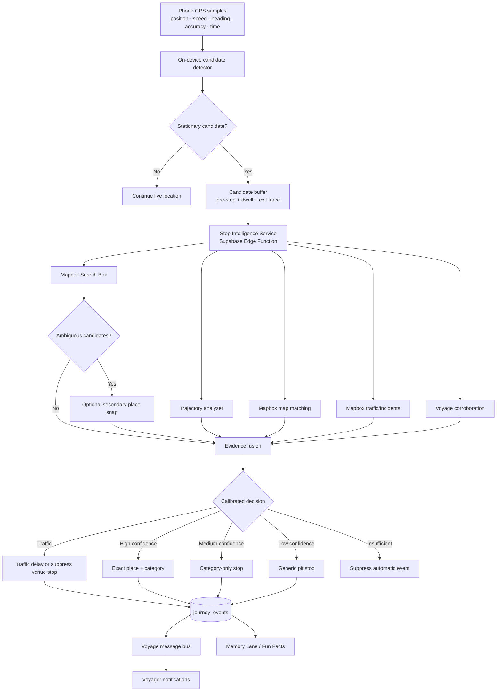
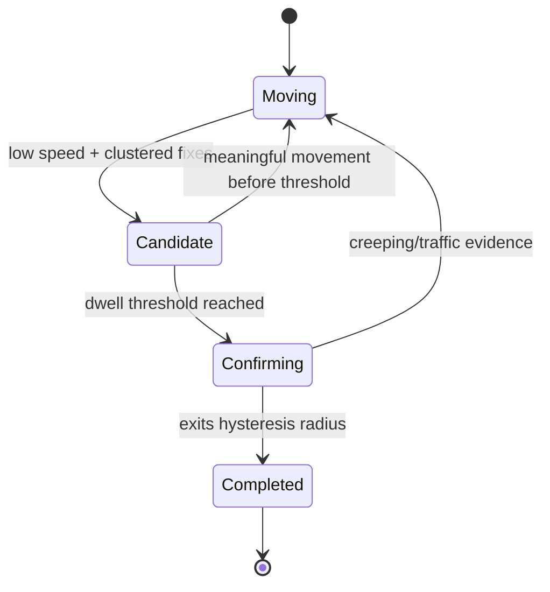
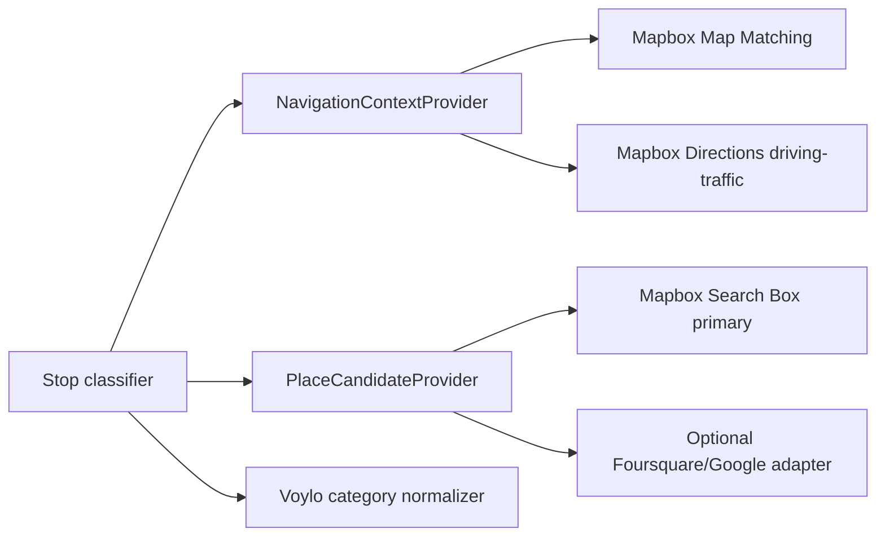
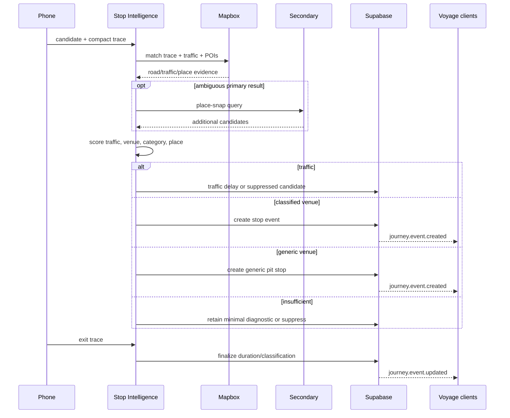

# Voylo Stop Intelligence Architecture

**Status:** Proposed for review; no implementation authorized

**Date:** 2026-08-10
**Companion:** `VOYLO-LIVE-JOURNEY-ARCHITECTURE.md`

## Decision summary

Voylo must not infer a venue from stationary GPS alone. Stop intelligence is a two-stage, confidence-calibrated system:

1. Determine whether the trace represents a meaningful venue stop, congestion, destination arrival, or insufficient evidence.
2. For a venue stop, rank nearby places and map provider categories into a stable Voylo taxonomy.

Mapbox is the primary provider for road matching, traffic context, and POI search because Voylo already uses Mapbox. The classifier is provider-neutral; a secondary place-snap provider may be queried only when primary evidence is ambiguous. Exact names are announced only at high confidence. Unknown is a valid, preferred result over a confident error.

## System context



## Boundary: detection is not classification

The candidate detector answers only: “Has this vehicle exhibited a stationary pattern worth evaluating?” It does not answer why the vehicle stopped.

Inputs:

- GPS capture time, location, speed, heading and accuracy.
- Rolling displacement and centroid.
- Sample consistency and impossible-jump rejection.
- Optional foreground motion activity where supported.

Initial state machine:



The effective cluster radius is accuracy-aware but capped. Poor accuracy lowers confidence; it never expands the candidate area without limit.

## Trace window

Classification consumes a compact, temporary trace rather than one coordinate:

- 1–2 minutes before candidate start.
- Downsampled dwell fixes.
- 1–2 minutes after movement resumes.
- Accuracy, speed, heading and capture timestamps.

The exit trace is valuable because it shows whether the vehicle returns to the same road, exits a parking facility, proceeds through congestion, or ends the Voyage at its destination.

## Stop versus traffic

### Traffic evidence

- High-confidence map match to a travel lane/road segment.
- Stop-and-creep cycles with forward displacement.
- Heading remains aligned with the road.
- Multiple independent Voyage vehicles slow on the same segment and time window.
- Traffic congestion or an incident is reported near the matched segment.
- No driveway/parking deviation and no strong place containment.
- Vehicle resumes forward travel on the same segment.

### Venue evidence

- Trace departs the travel road before clustering.
- Centroid is materially displaced from the matched road.
- Entry/exit uses an access road, driveway, or parking aisle.
- Samples cluster near a plausible POI/facility.
- Dwell duration is plausible for the category.
- Companion devices correlate as one vehicle, or several convoy vehicles independently enter the same facility.

### Destination and special queues

Destination arrival, border/customs queues, ferries, drive-throughs, curbside pickup, railroad crossings, long signals, shoulders, and overnight lodging are explicit negative scenarios. They must not fall through to a guessed coffee/fuel event.

## Provider architecture



Provider interfaces prevent Mapbox/Google/Foursquare response shapes from entering domain entities:

```ts
interface NavigationContextProvider {
  analyzeTrace(trace: StopTrace): Promise<RoadTrafficContext>;
}

interface PlaceCandidateProvider {
  findCandidates(stop: ConfirmedStop): Promise<PlaceCandidate[]>;
}

interface StopClassifier {
  classify(input: StopClassificationInput): Promise<StopClassification>;
}
```

### Primary recommendation: Mapbox

- Existing Voylo SDK, token, map and operational relationship.
- Map Matching accepts timestamped traces, returns snapped road points and confidence.
- Directions `driving-traffic` exposes traffic-informed routes and incidents.
- Search Box provides reverse/category POI search.
- Mapbox results align naturally with the Mapbox-rendered map.

### Secondary escalation

A second provider is not called for every stop. It is used only when top candidates are close, primary coverage is absent, or field data proves a systematic coverage gap.

- Foursquare Place Snap is purpose-built to associate coordinates with likely venues and is map-provider-neutral, but needs attribution/licensing review.
- Google Places provides strong coverage and explicit types such as `rest_stop`, `gas_station`, and `cafe`, but its content storage and display requirements are awkward alongside a Mapbox map. Google Place IDs may be stored; broader Places content is restricted.

The public OpenStreetMap Nominatim service is not a production classifier: its usage policy discourages periodic/systematic and vehicle-tracking-style workloads.

## Evidence fusion

Start with explicit scoring, versioned and observable. Do not start with an opaque generative-AI decision.

```text
trafficScore =
    roadAlignment
  + creepingPattern
  + liveTrafficEvidence
  + convoySlowdownEvidence
  - parkingDeviation
  - strongPlaceMatch

venueScore =
    roadDeparture
  + parkingCluster
  + entryExitPattern
  + dwellDuration
  + placeMatch
  + companionAgreement
  - trafficEvidence

placeScore =
    distance
  + categoryPlausibility
  + containment
  + entryExitAlignment
  + dwellCompatibility
  + providerConfidence
  + optionalProviderAgreement
```

Every output stores `classifierVersion` and normalized evidence scores so regressions can be audited without retaining raw provider responses indefinitely.

## Confidence policy

| Confidence/evidence | User-visible result |
| --- | --- |
| Exact-place confidence ≥ calibrated high threshold | “Fuel stop at Pilot — 12 min” |
| Category confidence high, place uncertain | “Fuel stop — 12 min” |
| Venue likely, category uncertain | “Pit stop — 12 min” |
| Traffic likely | No venue event; optionally “14 minutes in traffic” |
| Insufficient/conflicting evidence | Suppress automatic notification |

Thresholds such as 0.90/0.75 are hypotheses until calibrated on labeled field data. High-confidence exact-place precision matters more than automatic-event recall.

## Stable Voylo taxonomy

```ts
type StopCategory =
  | 'fuel'
  | 'coffee'
  | 'food'
  | 'rest_area'
  | 'service_plaza'
  | 'lodging'
  | 'shopping'
  | 'scenic'
  | 'attraction'
  | 'pickup_dropoff'
  | 'destination'
  | 'traffic'
  | 'unknown';
```

One facility may have a primary and secondary categories:

```json
{
  "primaryCategory": "service_plaza",
  "secondaryCategories": ["fuel", "coffee", "food"]
}
```

Provider category IDs map into this taxonomy through versioned configuration, never scattered conditionals.

## Event lifecycle



A stop is one idempotent event whose status and classification improve; it is not a chain of duplicate events.

## Proposed durable domain contract

```ts
type StopEvent = {
  id: string;
  voyageId: string;
  vehicleGroupId: string | null;
  status: 'candidate' | 'confirmed' | 'completed' | 'suppressed' | 'corrected';
  startedAt: string;
  confirmedAt: string | null;
  endedAt: string | null;
  durationSeconds: number | null;
  centroid: { lat: number; lng: number; accuracyM: number };
  classification: {
    kind: 'venue_stop' | 'traffic' | 'destination' | 'unknown';
    primaryCategory: StopCategory;
    secondaryCategories: StopCategory[];
    confidence: number;
  };
  place: {
    provider: 'mapbox' | 'foursquare' | 'google' | null;
    providerPlaceId: string | null;
    name: string | null;
    distanceM: number | null;
  };
  evidence: {
    roadMatchConfidence: number | null;
    distanceFromRoadM: number | null;
    trafficEvidence: boolean;
    convoyCorroborationCount: number;
    candidateCount: number;
    classifierVersion: string;
  };
  source: 'automatic' | 'user_confirmed' | 'user_corrected';
};
```

Raw provider responses are not domain records. Retention of provider name/category/ID must comply with the chosen provider agreement. Exact-place persistence for Memory Lane requires an explicit licensing decision.

## Companion and convoy deduplication

- Phones explicitly grouped as companions contribute evidence to one vehicle stop.
- Before companion grouping ships, highly correlated nearby traces are possible duplicates, not proof.
- Multiple independent vehicles entering the same facility may produce one group stop plus per-vehicle participation, rather than duplicate group notifications.
- Multiple vehicles slowing on the same road strengthen traffic classification.

## Offline and outage behavior

- Candidate detection continues locally without network.
- Compact evidence and the newest candidate state persist in a dedicated durable outbox.
- On reconnect, the server validates membership and Voyage timing before classification.
- `occurredAt` remains the real stop time; late classification is labeled naturally.
- Provider failure never blocks live location or Voyage lifecycle operations.
- If all classifiers fail, finalize as generic/unknown or suppress; never guess.

## Privacy and safety

- Classification is limited to active Voyages and the product purpose disclosed to users.
- Precise traces do not enter general logs or Sentry breadcrumbs.
- Temporary trace retention is bounded and independently governed from Memory Lane.
- Sensitive POI categories must not be used to infer health, religion, addiction, pregnancy, sexual orientation, or other sensitive traits.
- Driver-facing notifications remain passive and follow Voylo’s driver-safety interaction model.
- User correction is the final product truth and updates the existing event.

## Failure matrix

| Scenario | Required behavior |
| --- | --- |
| Stoplight beside a cafe | Road alignment/short dwell; no cafe event |
| Congestion beside fuel station | Traffic evidence wins; no fuel event |
| Highway shoulder near rest area | Require entrance/property evidence; generic/suppress |
| Shared shopping plaza | Category-only or generic unless one candidate dominates |
| Starbucks inside Target | Parent facility primary; coffee secondary if supported |
| Service plaza | `service_plaza` primary; fuel/coffee/food secondary |
| Border/customs queue | Special queue/traffic, not venue stop |
| Drive-through | Short-dwell policy; likely food/coffee only with strong trace/place match |
| Tunnel/urban GPS drift | Lower confidence; no exact place |
| Phone remains while car leaves | Vehicle/companion correlation detects divergence |
| Multiple phones in one car | One vehicle event, deduplicated idempotently |
| Destination arrival | Destination classification, not a pit stop |
| Provider unavailable | Generic/unknown; location remains unaffected |
| Entire stop offline | Classify after reconnect using retained compact evidence |

## Validation and rollout

Build a labeled field dataset before enabling automatic exact-place notifications:

- ≥25 traffic/stoplight/queue cases.
- ≥25 fuel stops.
- ≥25 coffee/food stops.
- ≥20 rest areas/service plazas.
- ≥20 ambiguous shopping-center stops.
- ≥10 shoulders/scenic overlooks.
- Multiple device models, GPS conditions, foreground/background states, and convoy sizes.

Initial gates:

- Traffic misclassified as a venue below 1–2%.
- High-confidence exact-place precision above 95%.
- High-confidence category precision above 95%.
- Companion duplicate group notifications near zero.
- Unknown rate may be high initially; false confidence may not.
- One classification workflow per candidate, never one API request per GPS fix.
- Provider outage and rate limiting do not affect location tracking.

Rollout order:

1. Shadow classification: record scores, notify nobody.
2. Internal labeled field comparison and weight calibration.
3. Generic/category-only events.
4. High-confidence exact-place events.
5. Optional secondary provider only if measured gaps justify it.
6. User correction feedback loop; no silent self-training without review.

## Research sources

- [Mapbox Map Matching API](https://docs.mapbox.com/api/navigation/map-matching/)
- [Mapbox Directions and traffic incidents](https://docs.mapbox.com/api/navigation/directions/)
- [Mapbox Search Box API](https://docs.mapbox.com/api/search/search-box/)
- [Google Nearby Search](https://developers.google.com/maps/documentation/places/web-service/nearby-search)
- [Google Place Types](https://developers.google.com/maps/documentation/places/web-service/place-types)
- [Google Places policies](https://developers.google.com/maps/documentation/places/web-service/policies)
- [Foursquare Places API](https://foursquare.com/products/places-api/)
- [Foursquare Place Search](https://docs.foursquare.com/fsq-developers-places/reference/place-search)
- [OpenStreetMap Nominatim usage policy](https://operations.osmfoundation.org/policies/nominatim/)

## Review decisions still required

1. Approve Mapbox-primary/adaptive-secondary provider strategy.
2. Approve the confidence-first notification policy.
3. Decide whether exact venue names must persist in Memory Lane; this determines licensing work.
4. Decide whether a traffic delay should be a live event, recap-only fact, or both.
5. Define companion/vehicle grouping before group-stop deduplication ships.
6. Approve a field-data collection plan before classifier thresholds become production constants.
